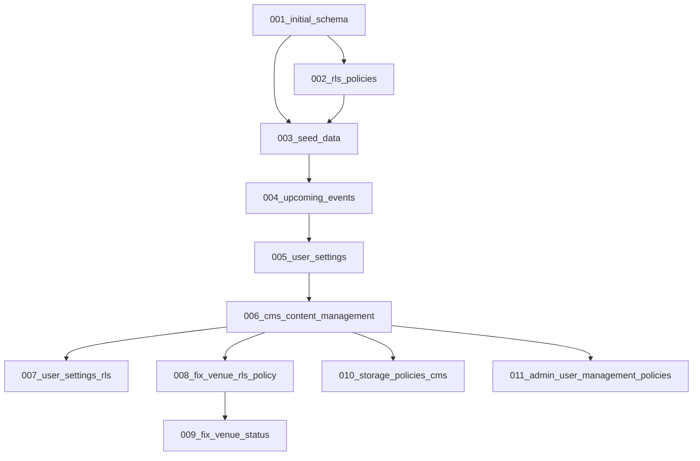

# Migration Index

Comprehensive overview of all database migrations with their specific changes and dependencies.

## Migration Timeline

| Migration | File | Description | Status | Dependencies |
|-----------|------|-------------|---------|--------------|
| 001 | `001_initial_schema.sql` | Initial database schema setup | ✅ Applied | None |
| 002 | `002_rls_policies.sql` | Row Level Security policies | ✅ Applied | 001 |
| 003 | `003_seed_data.sql` | Seed data for venues and initial content | ✅ Applied | 001, 002 |
| 004 | `004_upcoming_events.sql` | Enhanced event management | ✅ Applied | 001-003 |
| 005 | `005_user_settings.sql` | User preferences and activity tracking | ✅ Applied | 001-004 |
| 006 | `006_cms_content_management.sql` | CMS content management system | ✅ Applied | 001-005 |
| 007 | `007_user_settings_rls.sql` | Privacy controls and profile visibility | ✅ Applied | 005, 006 |
| 008 | `008_fix_venue_rls_policy.sql` | Admin venue access permissions | ✅ Applied | 006 |
| 009 | `009_fix_venue_status.sql` | Venue status management fixes | ✅ Applied | 006, 008 |
| 010 | `010_storage_policies_cms.sql` | File storage policies for CMS | ✅ Applied | 006 |
| 011 | `011_admin_user_management_policies.sql` | Admin user management & fixed RLS policies | ✅ Applied | 006 |

## Detailed Changes

### 001_initial_schema.sql
**Core Platform Foundation**
- Creates all primary tables (profiles, venues, events, artists)
- Sets up user role enum (fan, artist, promoter, club_owner, admin)
- Establishes foreign key relationships
- Creates indexes for performance

**Tables Created:**
- `profiles` - User profiles with authentication data
- `venues` - Venue information with location data
- `events` - Event management with venue relationships  
- `artists` - Artist profiles with social media links
- `event_artists` - Many-to-many relationship for event lineups

### 002_rls_policies.sql
**Security Layer Implementation**
- Implements Row Level Security on all tables
- Creates role-based access policies
- Ensures data isolation between users
- Public read access for published content

### 003_seed_data.sql
**Initial Content Population**
- Seeds popular Berlin venues (Berghain, Tresor, Watergate, etc.)
- Creates sample events and artist profiles
- Establishes baseline data for development/testing

### 004_upcoming_events.sql  
**Event Enhancement**
- Adds event status management
- Creates upcoming events views
- Enhances event filtering capabilities
- Adds event capacity and pricing fields

### 005_user_settings.sql
**User Experience Features**
- User preference management (notifications, privacy)
- Activity tracking system
- Social connections (following/followers)
- Profile view analytics

### 006_cms_content_management.sql
**Content Management System**
- Adds CMS columns to all content tables (status, created_by, updated_by)
- Creates content moderation log table
- Implements draft/published workflow
- Adds venue_type enum and validation

**Key Changes:**
```sql
-- Added to venues, events, artists tables
ALTER TABLE table_name ADD COLUMN status VARCHAR(20) DEFAULT 'draft';
ALTER TABLE table_name ADD COLUMN created_by UUID REFERENCES profiles(id);
ALTER TABLE table_name ADD COLUMN updated_by UUID REFERENCES profiles(id);
ALTER TABLE table_name ADD COLUMN published_at TIMESTAMPTZ;
```

### 007_user_settings_rls.sql
**Privacy and Social Features**
- Granular privacy controls for profiles
- Social connection policies  
- Profile visibility functions (public/private/friends)
- Activity feed privacy controls

### 008_fix_venue_rls_policy.sql
**Venue Access Control Fix**
- Updates venue creation policies
- Allows admins to create/edit all venues
- Restricts club owners to their own venues
- Fixes permission validation logic

### 009_fix_venue_status.sql
**Status Management Cleanup**
- Updates existing venues to published status
- Fixes status consistency across venue data
- Ensures proper public visibility

### 010_storage_policies_cms.sql
**File Storage Policies**
- Creates storage buckets for different content types
- Implements role-based file access
- Sets up organized file path structure
- Enables public access for published content

### 011_admin_user_management_policies.sql
**Admin User Management & RLS Policy Fixes**
- Updates events INSERT policy to allow admins to create events
- Updates artists INSERT policy to allow admins to create artist profiles
- Fixes profiles table infinite recursion issues in RLS policies
- Implements non-recursive admin permission checks
- Enables comprehensive user management for admin users

**Key Changes:**
```sql
-- Fixed infinite recursion by using direct SELECT instead of EXISTS subqueries
CREATE POLICY "Admins can update any profile" ON profiles
FOR UPDATE USING (
  (SELECT role FROM profiles WHERE id = auth.uid() LIMIT 1) = 'admin'
);

-- Added admin permissions to content creation policies
-- Admins can now create events and artist profiles regardless of verification status
```

## Migration Dependencies



## Recent Changes Summary

The CMS implementation (migrations 006-011) represents a major platform enhancement:

1. **Content Lifecycle Management**: Complete draft → published workflow
2. **Role-Based Permissions**: Granular access control for different user types  
3. **Content Moderation**: Automated moderation with audit logging
4. **Storage Organization**: Structured file storage with proper access policies
5. **Privacy Controls**: Comprehensive user privacy and visibility settings
6. **Admin User Management**: Complete user management system with role-based permissions

### Latest Addition (Migration 011)
**Admin User Management System** - Added comprehensive user management capabilities:
- Admins can view, edit, and delete any user profiles
- Role and verification status management
- Email lookup from auth.users table  
- Fixed infinite recursion issues in RLS policies
- Non-recursive admin permission checks
- Enhanced content creation permissions for admins

All migrations have been tested and applied successfully to the development database.